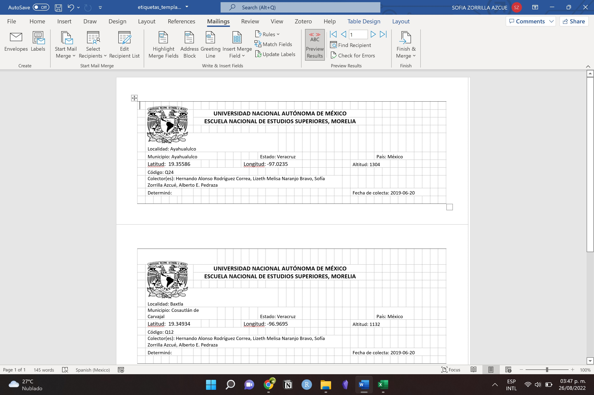
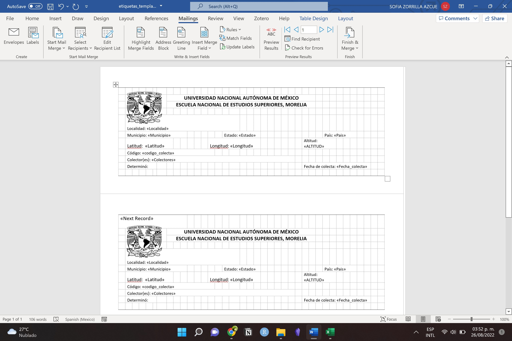
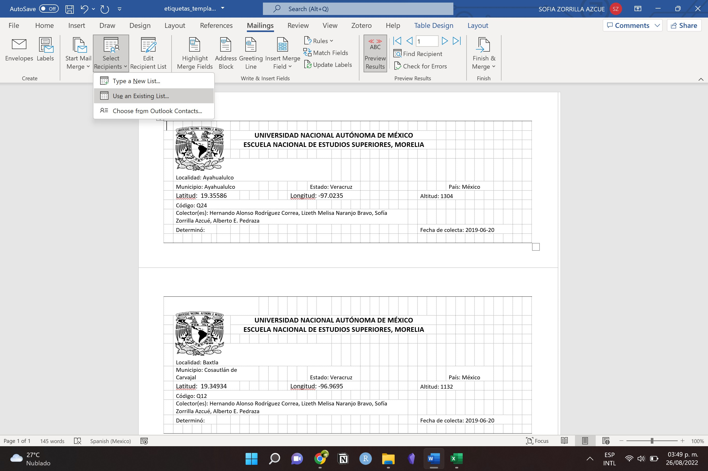
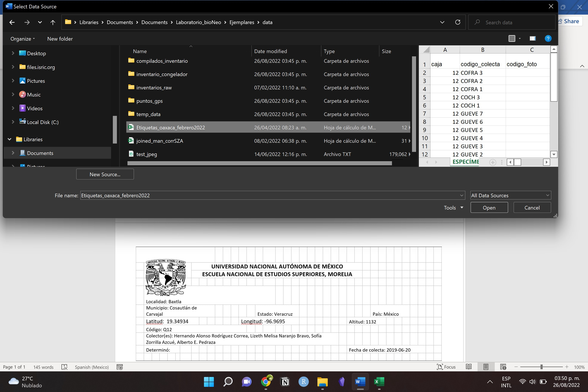
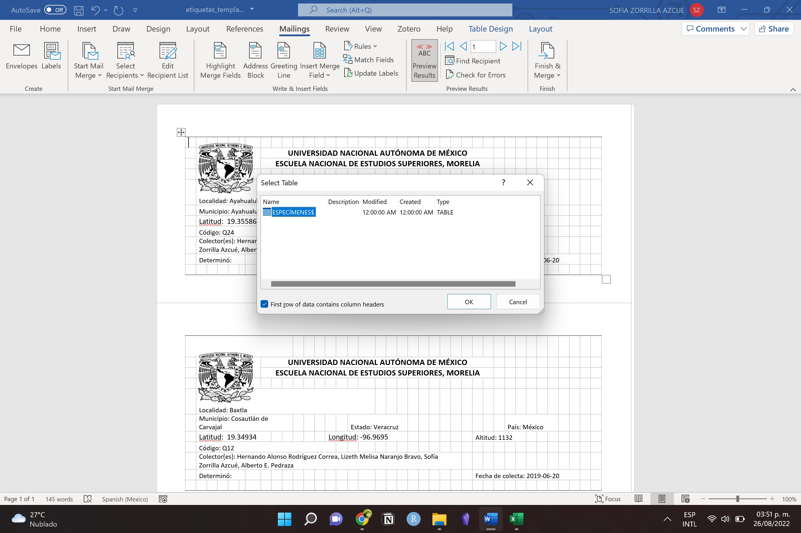
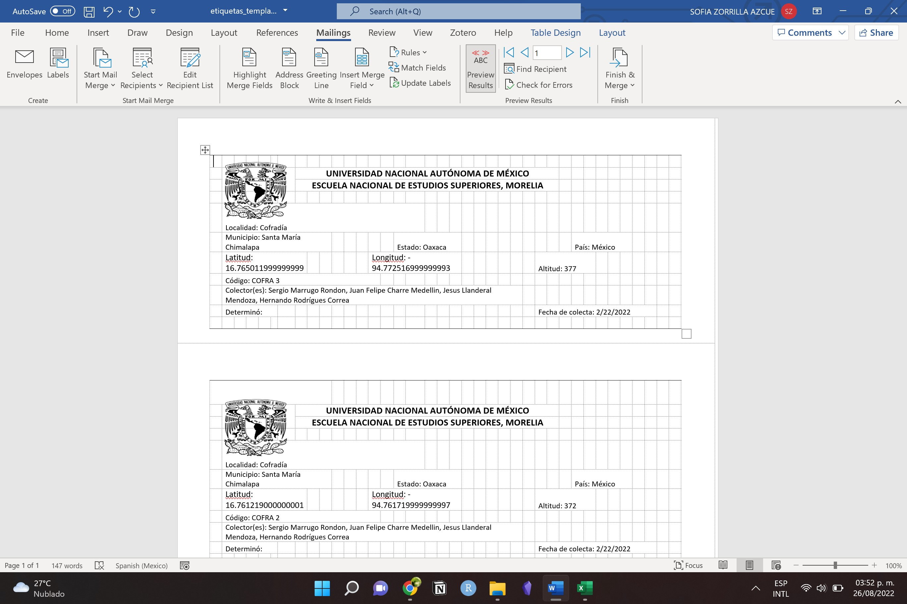

# Crear las etiquetas de todos los ejemplares con Word y una tabla de datos.

En el repositorio de [ejemplares](https://github.com/sofiazorrilla/ejemplares_BN) (o el folder en la computadora del laboratorio), hay un template para hacer las etiquetas de todos los ejemplares utilizando una tabla de excel como archivo de entrada. A continuación se describe el proceso para hacerlo:

1. Abrir el formato en la computadora en la que tiene la tabla de excel con los datos de las etiquetas. Seleccionar la pestaña de Word de `Mailings`.

Cada renglón de la tabla de excel va a corresponder a una etiqueta.Las columnas tienen que estar nombradas con las palabras que aparecen entre `<< >>` en la siguiente imagen. A través de esos encabezados es que word puede reemplazar la información en cada etiqueta.

2. En la pestaña de `Select Recipients` seleccionar `Use an exsisting list`.

3. Seleccionar el archivo con la tabla de excel.

4. ¡Listo! la información será llenada para cada etiqueta. Si quieres revisar los resultados puedes seleccionar la pestaña de `Preview results` y moverte entre hojas de etiquetas con las flechas que están a la derecha. Una vez que estés listo puedes mandar a imprimir o guardar el archivo de etiquetas completo utilizando la opción de `Finish & Merge` (imprimir o editar cada documento individualmente)

