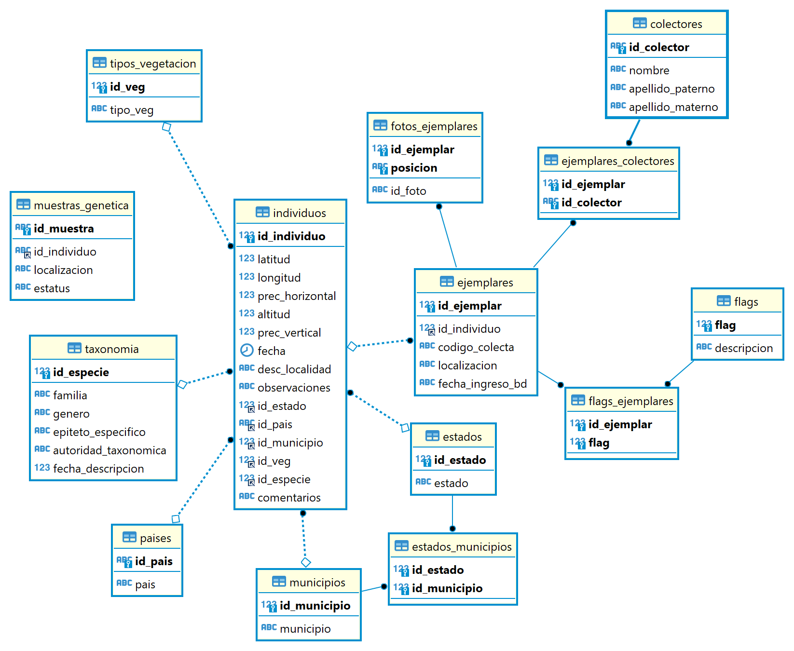

# Manual de toma de datos en campo

### Contenidos
1. [Introducción](##Introducción)
2. [Diseño de base de datos](##Diseño)
3. [Aprendizajes](##Aprendizajes)
4. [Checklist antes/después de campo](##Checklist)\

## Introducción

- ¿Qué es una base de datos relacional?
- Reglas básicas de una base de datos
  - Qué define una tabla
  - Llaves primarias y secundarias
  - Relaciones entre tablas
- Glosario

## Diseño

La base de datos de ejemplares del laboratorio se compone de 14 tablas. En la siguiente tabla encontrarás una descripción de la información que se almacena en cada una, su unidad básica y sus claves primarias y secundarias.

| Tabla                 | Descripción                                                                                                                                                                                                      | Clave primaria (PK)     | Clave secundaria (FK)                                                       |
|-----------------------|------------------------------------------------------------------------------------------------------------------------------------------------------------------------------------------------------------------|-------------------------|-----------------------------------------------------------------------------|
| individuos            | Almacena información a nivel de individuos. Es decir su ubicación geográfica (y precisión correspondiente), id del tipo de vegetación, id de la especie, fecha de colecta y comentarios u observaciones de campo | id_individuo            | id_estado  id_municipio  id_pais  id_especie  id_veg = id de tipo de vegetación |
| ejemplares            | Almacena información a nivel del ejemplar (i.e. dónde se encuentra físicamente, fecha de captura en la base de datos, de qué individuo proviene)                                                                 | id_ejemplar             | id_individuo                                                                |
| fotos_ejemplares      | Relaciona el código de los ejemplares con el id de las fotos. La posición se refiere a si la foto es principalmente del haz o del revés del ejemplar                                                             | id_ejemplar posición    |                                                                             |
| colectores            | Catálogo de nombres de colectores. A cada uno se le asigna un ID compuesto de 3 iniciales mayúsculas.                                                                                                            | id_colector             |                                                                             |
| ejemplares_colectores | Relaciona el código de los colectores con los ejemplares que han colectado                                                                                                                                       | id_colector id_ejemplar |                                                                             |
| taxonomia             | Catálogo de especies con su respectiva información taxonómica (familia, género, autoridad taxonómica, presencia en la filogenia)                                                                                 | id_especie              |                                                                             |
| paises                | Catálogo de paises                                                                                                                                                                                               | id_pais                 |                                                                             |
| estados               | Catálogo de estados o departamentos.                                                                                                                                                                             | id_estado               |                                                                             |
| municipios            | Catálogo de municipios.                                                                                                                                                                                          | id_municipio            |                                                                             |
| estados_municipios    | Relación entre municipios y estados. Esta tabla es importante porque hay municipios con el mismo nombre en distintos estados.                                                                                    | id_estado id_municipio  |                                                                             |
| tipos_vegetación      | Catálogo de tipos de vegetación                                                                                                                                                                                  | id_veg                  |                                                                             |
| flags                 | Código para casos de identificación faltante. Por ejemplo falta de coordenadas = 1. Los flags tienen distinto nivel de gravedad.                                                                                 | id_flag                 |                                                                             |
| flags_ejemplares      | Relación entre ejemplares y flags. A un mismo ejemplar le puede hacer falta diferente información, por lo tanto puede tener más de un flag.                                                                      | id_flag id_ejemplar     |                                                                             |
| muestras_genética     | Relaciona la información de los individuos con las muestras que están guardadas en el congelador. Además indica en qué lugar físico están guardadas las muestras y si son hojas enteras o molidas.               | id_muestra              | id_individuo                                                                |

Las tablas se relacionan unas con otras de la siguiente manera:

Para acceder a la información se deben realizar los siguientes pasos:

### SQL

1. Conectarse a la base de datos con su usuario y contraseña. Se pueden usar diferentes clientes de bases de datos. La recomendación es usar DBeaver.
2. Abrir una consola de SQL y escribir los comandos que se vayan a utilzar.

Algunos ejemplos de comandos comunes son los siguientes (más información sobre [SQL](https://www.w3schools.com/sql/))

Seleccionar todas las columnas (*) de una tabla.

      SELECT * FROM <nombre_tabla>

Seleccionar las columnas id_individuo y id_ejemplar de la tabla de individuos

      SELECT id_individuo, id_ejemplar FROM individuos

Filtros. Por ejemplo selecciona los individuos que se encuentren en altitudes mayores a 1000 m.

      SELECT id_individuo FROM individuos
      WHERE altitud > 1000

Unir tablas (por ejemplo la tabla de individuos con la de taxonomía para saber de qué especie es cada individuo). El comando se lee de la siguiente manera "selecciona las columnas id_individuo id_genero y epiteto_especifico de la tabla de individuos a la que se le une la tabla de taxonomía. La unión se realiza usando como índice la columna id_especie de las tablas individuo y taxonomía". En este caso, en el comando de SELECT es importante indicar de qué tabla estamos tomando las columnas. Eso se hace poniendo el nombre de la tabla seguido de un punto y el nombre de la columna.

      SELECT individuos.id_individuo, taxonomia.genero, taxonomia.epiteto_especifico, FROM individuos
      LEFT JOIN taxonomia ON individuos.id_especie = taxonomia.id_especie

### R

Los datos se pueden leer de la base de datos y usar en R como cualquier tabla. Para hacerlo hay que escribir una búsqueda de SQL y mandarla a través del paquete "RMariaDB". Las búsquedas de SQL pueden llamar las tablas completas para posteriormente ser manipuladas completamente en R o pueden incluir uniones, filtros y otras modificaciones. A continuación pongo un ejemplo para llamar la tabla completa de individoos.

    library("RMariaDB")

    # Primero hay que generar un objeto con los parámetros de la conexión a la base de datos (nombre de usuario, nombre de la base de datos, contraseña, etc)

    conn <- dbConnect(
      drv = RMariaDB::MariaDB(),
      username = "username",
      password = "password",
      host = "Dirección IP",
      port = 3306,
      dbname = "ejemplares"
    )

    # Posteriormente se manda la búsqueda en sql

    query <- dbSendQuery("SELECT * FROM individuos")

    # Le pedimos que ejecute la búsqueda y que guarde el resultado en un objeto

    individuos <- dbFetch(query)

    # Listo, nuestra tabla de individuos en la base de datos va a estar guardada como dataframe en un objeto de R

## Aprendizajes

En esta sección el objetivo es describir los principales errores que cometimos para tratar de generar estrategias para minimizarlos y evitar que sigan sucediendo.

| Error                                               | Descripción                                                                                                                                                                               | Consecuencias                                                                                                                                                                                                                                      |
|-----------------------------------------------------|-------------------------------------------------------------------------------------------------------------------------------------------------------------------------------------------|----------------------------------------------------------------------------------------------------------------------------------------------------------------------------------------------------------------------------------------------------|
| Falta de estandarización                            | En cada salida de campo se asignó un sistema de codificación de ejemplares.                                                                                                               | - Pérdida de información  - Gran dificultad para revisar la información  - Muchos errores a la hora de transcribir                                                                                                                  |
| Falta de estandarización                            | Mucha variabilidad en la forma que se capturaban los datos de los registros.                                                                                                              | - No se puede automatizar  - Errores de transcripción                                                                                                                                                                                    |
| Falta de información                                | La información faltante más grave es la falta de coordenadas. Sin embargo faltó registrar fechas de colecta, localidades, precisión de las coordenadas, colectores, etc. en muchos casos. | - Registros incompletos                                                                                                                                                                                                                       |
| Falta de mantenimiento constante de la información  | Durante mucho tiempo la información se quedó sin centralizar y los ejemplares sin resguardar.                                                                                             | - Información incompleta o dispersa guardada con distintos sistemas  - Desgaste de los ejemplares  - Olvidamos los sistemas de codificación utilizados  - Los volúmenes tan grandes de información son difíciles de verificar  |

## Protocolo de colecta

### Antes de salir a campo

1. Imprimir formatos de colecta suficientes (se va a tener que entregar al menos 1 por cada localidad en la que se hayan colectado ejemplares)
2. Llevar GPS, tabla y lápices para poder anotar en campo

### En campo
3. Cambiar el texto por default en los waypoints al inicio de la salida ([instrucciones]()). El código de los individuos se compone de la primera letra del estado, el mes y el año de la salida. Seguido de guion bajo y un número consecutivo para cada ejemplar.
4. Preferiblemente tomar coordenada de cada ejemplar con el GPS. 
3. De preferencia no tomar coordenadas con celular (especialmente dentro del bosque). En caso de que si conseguir altitud y precisión.
4. Tomar medidas de precisión horizontal y vertical en el GPS
