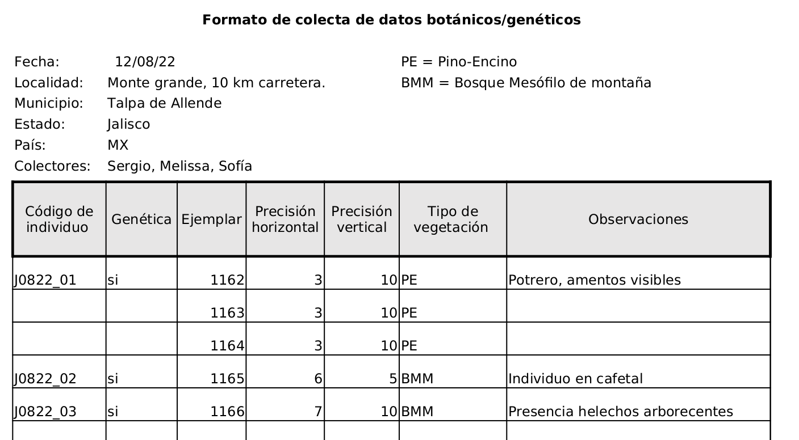

# Manual de toma de datos en campo


### Contenidos
1. [Introducción](##Introducción)
2. [Diseño de base de datos](##Diseño)
3. [Aprendizajes](##Aprendizajes)
4. [Checklist antes/después de campo](##Checklist)\


## Introducción

- ¿Qué es una base de datos relacional?
- Reglas básicas de una base de datos
  - Qué define una tabla
  - Llaves primarias y secundarias
  - Relaciones entre tablas
- Glosario

## Diseño

La base de datos de ejemplares del laboratorio se compone de 14 tablas. En la siguiente tabla encontrarás una descripción de la información que se almacena en cada una, su unidad básica y sus claves primarias y secundarias.


| Tabla                 | Descripción                                                                                                                                                                                                      | Clave primaria (PK)     | Clave secundaria (FK)                                                       |
|-----------------------|------------------------------------------------------------------------------------------------------------------------------------------------------------------------------------------------------------------|-------------------------|-----------------------------------------------------------------------------|
| individuos            | Almacena información a nivel de individuos. Es decir su ubicación geográfica (y precisión correspondiente), id del tipo de vegetación, id de la especie, fecha de colecta y comentarios u observaciones de campo | id_individuo            | id_estado<br /> id_municipio<br /> id_pais<br /> id_especie<br /> id_veg = id de tipo de vegetación |
| ejemplares            | Almacena información a nivel del ejemplar (i.e. dónde se encuentra físicamente, fecha de captura en la base de datos, de qué individuo proviene)                                                                 | id_ejemplar             | id_individuo                                                                |
| fotos_ejemplares      | Relaciona el código de los ejemplares con el id de las fotos. La posición se refiere a si la foto es principalmente del haz o del revés del ejemplar                                                             | id_ejemplar posición    |                                                                             |
| colectores            | Catálogo de nombres de colectores. A cada uno se le asigna un ID compuesto de 3 iniciales mayúsculas.                                                                                                            | id_colector             |                                                                             |
| ejemplares_colectores | Relaciona el código de los colectores con los ejemplares que han colectado                                                                                                                                       | id_colector id_ejemplar |                                                                             |
| taxonomia             | Catálogo de especies con su respectiva información taxonómica (familia, género, autoridad taxonómica, presencia en la filogenia)                                                                                 | id_especie              |                                                                             |
| paises                | Catálogo de paises                                                                                                                                                                                               | id_pais                 |                                                                             |
| estados               | Catálogo de estados o departamentos.                                                                                                                                                                             | id_estado               |                                                                             |
| municipios            | Catálogo de municipios.                                                                                                                                                                                          | id_municipio            |                                                                             |
| estados_municipios    | Relación entre municipios y estados. Esta tabla es importante porque hay municipios con el mismo nombre en distintos estados.                                                                                    | id_estado id_municipio  |                                                                             |
| tipos_vegetación      | Catálogo de tipos de vegetación                                                                                                                                                                                  | id_veg                  |                                                                             |
| flags                 | Código para casos de identificación faltante. Por ejemplo falta de coordenadas = 1. Los flags tienen distinto nivel de gravedad.                                                                                 | id_flag                 |                                                                             |
| flags_ejemplares      | Relación entre ejemplares y flags. A un mismo ejemplar le puede hacer falta diferente información, por lo tanto puede tener más de un flag.                                                                      | id_flag id_ejemplar     |                                                                             |
| muestras_genética     | Relaciona la información de los individuos con las muestras que están guardadas en el congelador. Además indica en qué lugar físico están guardadas las muestras y si son hojas enteras o molidas.               | id_muestra              | id_individuo                                                                |


Las tablas se relacionan unas con otras de la siguiente manera:


Para acceder a la información se deben realizar los siguientes pasos:

### SQL

1. Conectarse a la base de datos con su usuario y contraseña. Se pueden usar diferentes clientes de bases de datos. La recomendación es usar DBeaver.
2. Abrir una consola de SQL y escribir los comandos que se vayan a utilzar.

Algunos ejemplos de comandos comunes son los siguientes (más información sobre [SQL](https://www.w3schools.com/sql/))

Seleccionar todas las columnas (*) de una tabla.

      SELECT * FROM <nombre_tabla>

Seleccionar las columnas id_individuo y id_ejemplar de la tabla de individuos

      SELECT id_individuo, id_ejemplar FROM individuos

Filtros. Por ejemplo selecciona los individuos que se encuentren en altitudes mayores a 1000 m.

      SELECT id_individuo FROM individuos
      WHERE altitud > 1000

Unir tablas (por ejemplo la tabla de individuos con la de taxonomía para saber de qué especie es cada individuo). El comando se lee de la siguiente manera "selecciona las columnas id_individuo id_genero y epiteto_especifico de la tabla de individuos a la que se le une la tabla de taxonomía. La unión se realiza usando como índice la columna id_especie de las tablas individuo y taxonomía". En este caso, en el comando de SELECT es importante indicar de qué tabla estamos tomando las columnas. Eso se hace poniendo el nombre de la tabla seguido de un punto y el nombre de la columna.

      SELECT individuos.id_individuo, taxonomia.genero, taxonomia.epiteto_especifico, FROM individuos
      LEFT JOIN taxonomia ON individuos.id_especie = taxonomia.id_especie

### R

Los datos se pueden leer de la base de datos y usar en R como cualquier tabla. Para hacerlo hay que escribir una búsqueda de SQL y mandarla a través del paquete "RMariaDB". Las búsquedas de SQL pueden llamar las tablas completas para posteriormente ser manipuladas completamente en R o pueden incluir uniones, filtros y otras modificaciones. A continuación pongo un ejemplo para llamar la tabla completa de individoos.

    library("RMariaDB")

    # Primero hay que generar un objeto con los parámetros de la conexión a la base de datos (nombre de usuario, nombre de la base de datos, contraseña, etc)

    conn <- dbConnect(
      drv = RMariaDB::MariaDB(),
      username = "username",
      password = "password",
      host = "Dirección IP",
      port = 3306,
      dbname = "ejemplares"
    )

    # Posteriormente se manda la búsqueda en sql

    query <- dbSendQuery("SELECT * FROM individuos")

    # Le pedimos que ejecute la búsqueda y que guarde el resultado en un objeto

    individuos <- dbFetch(query)

    # Listo, nuestra tabla de individuos en la base de datos va a estar guardada como dataframe en un objeto de R

## Aprendizajes

En esta sección el objetivo es describir los principales errores que cometimos para tratar de generar estrategias para minimizarlos y evitar que sigan sucediendo.

| Error                                               | Descripción                                                                                                                                                                               | Consecuencias                                                                                                                                                                                                                                      |
|-----------------------------------------------------|-------------------------------------------------------------------------------------------------------------------------------------------------------------------------------------------|----------------------------------------------------------------------------------------------------------------------------------------------------------------------------------------------------------------------------------------------------|
| Falta de estandarización                            | En cada salida de campo se asignó un sistema de codificación de ejemplares.                                                                                                               | - Pérdida de información<br /> - Gran dificultad para revisar la información<br /> - Muchos errores a la hora de transcribir<br />                                                                                                                 |
| Falta de estandarización                            | Mucha variabilidad en la forma que se capturaban los datos de los registros.                                                                                                              | - No se puede automatizar<br /> - Errores de transcripción<br />                                                                                                                                                                                   |
| Falta de información                                | La información faltante más grave es la falta de coordenadas. Sin embargo faltó registrar fechas de colecta, localidades, precisión de las coordenadas, colectores, etc. en muchos casos. | - Registros incompletos<br />                                                                                                                                                                                                                      |
| Falta de mantenimiento constante de la información  | Durante mucho tiempo la información se quedó sin centralizar y los ejemplares sin resguardar.                                                                                             | - Información incompleta o dispersa guardada con distintos sistemas<br /> - Desgaste de los ejemplares<br /> - Olvidamos los sistemas de codificación utilizados<br /> - Los volúmenes tan grandes de información son difíciles de verificar<br /> |


## Protocolo de colecta

### Antes de salir a campo

1. Imprimir formatos de colecta suficientes (se va a tener que entregar al menos 1 por cada localidad en la que se hayan colectado ejemplares)
  - Revisa el número de individuo y de ejemplar desde el que hay que empezar a contar.
2. Llevar GPS, tabla y lápices para poder anotar en campo

### En campo

**GPS**

3. Temporalmente escoger un prefijo inicial y llevar un registro adecuado de qué coordenadas corresponden a cada ejemplar. En lo posible marcar una coordenada por árbol. (*Al final de la salida se debe entregar la tabla con las coordenadas asociadas a cada individuo, los codigos del gps son temporales*)
  - De preferencia no tomar coordenadas con celular (especialmente dentro del bosque). En caso de que si conseguir altitud y precisión con el gps.

4. Tomar medidas de precisión horizontal y vertical en el GPS.

**Metadatos**
*El formato sugerido para cada localidad lo pueden encontrar en la carpeta de formatos*



5. Registrar tipo de vegetación de cada individuo

6. Registrar otras observaciones importantes como datos fenológicos, uso del terreno (potrero, cafetal, etc.), otras plantas cercanas que pudieran ser de interés posterior (especies trabajadas por colaboradores).

7. Registrar si se llevó muestra de genética.

8. Hacer una descripción adecuada de la localidad

9. Registrar fecha de colecta y colectores.

10. Al final del día revisar que se tengan completos los datos de campo y las coordenadas.

**Tip:** En el GPS se puede asignar un símbolo diferente a los waypoints. Ese símbolo aparece por default una vez que es elegido. Es útil porque a través de los símbolos se pueden seleccionar conjuntos particulares de waypoints. Otra forma de seleccionar subconjuntos es por texto (usando el prefijo elegido).

**Genetica**
10. El código en la bolsa de la muestra de genética debe coincidir con el código del individuo.

11. En caso de que se vayan a almacenar con sílica, limpiar las hojas con alcohol antes de ponerlas en la sílica. Esto es para evitar contaminación en las hojas que una vez que están secas es difícil de remover. (*las hojas que se mantienen frescas se pueden limpiar en el laboratorio, antes de moler*)

12. Después de terminar de prensar, revisar que se hayan tomado todas las muestras de genética.

### Después de campo

13. Revisar que todo el material que se llevaron haya regresado. **Entregar una lista de material que haya que reponer.**

14. Antes de meter las bolsas de genética al congelador, revisa que tengas los codigos apropiados.
  - Etiqueta la bolsa que contiene las muestras de acuerdo a la repisa en donde se van a guardar y con el número consecutivo que le corresponde (dentro de esa repisa).
  - Anota el código que asignaste a la bolsa en tus hojas con datos de campo.


15. Lo más pronto que puedas, digitaliza la información que recolectaste en campo y ponla a disposición de todos.
  - Revisa que tus coordenadas correspondan a los lugares que visitaste
  - ¡Actualiza la base de datos de ejemplares! (en caso de que se te dificulte genera las tablas correspondientes a tus datos y pide ayuda)
  - Actualiza las tablas de gastos una vez que hayas hecho cuentas y juntado las facturas del viaje, para que se pueda hacer un buen presupuesto el año que viene.


16. Guarda tus formatos de colecta de datos botanicos en la carpeta del laboratorio. (Respaldo en físico de la información).

18. Genera las etiquetas de tus ejemplares (utiliza el template de etiquetas de word que está guardado en la carpeta de etiquetas y una tabla de excel) y añádela al periódico de cada ejemplar

17. Fotografía los ejemplares que se colectaron en la salida (2 fotos por ejemplar, haz y envés). El codigo de la foto se construye de la siguiente manera:
  - 2 letras del pais, 3 letras del estado, id_ejemplar, guion bajo, 1 ó 2 dependiendo si es haz o reves
  > Ejemplo: MXJAL1162_1.jpeg

  **Tip:** Si lo quieres intentar de forma automática, los nombres de los archivos se pueden cambiar en R con la función `file.rename()`

  **Sugerencia:** *haz un respaldo de las fotos y algunas pruebas antes de hacerlo con todas*
  ```
  Genera una tabla con la siguiente información

      id_ejemplar   nombre_foto     nuevo_nombre
      1162          IMG_0799.jpeg   MXJAL1162_1.jpeg
      1162          IMG_0800.jpeg   MXJAL1162_2.jpeg

  La puedes meter a la siguiente función

  file.rename(from = tabla$nombre_foto, to = tabla$nuevo_nombre)
```

19. Termina de actualizar la base de datos con la información de las fotos. Sube tus fotos a la carpeta compartida de [drive](https://drive.google.com/drive/folders/1yIp6QcDyybJY77OXs0-89Clibz99G2o8?usp=sharing)
